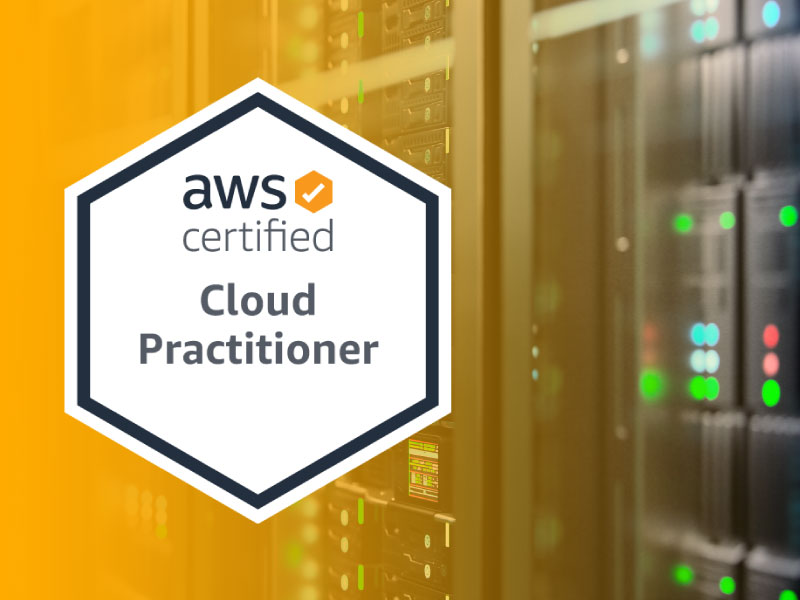

# AWS - Cloud Practitioner Certification
### Certification Guide - Tips and Tricks

The Practitioner AWS certification is the first available certification for AWS and, as we could imagine, is the most introductory. But that doesn’t mean we can underestimate this exam. The most experienced ones who might try this test must still make an effort to pass the certification exam.

This is because although the test is superficial, it englobes all of the services from AWS, and it will be up to date. We from the IT Universe can't have the luxury of thinking that we know better; we need to be updating ourselves even for a simple test to be sure how and which services AWS has and still uses.

That said, I’ve prepared the most consistently and effectively, and I believe in ensuring we can bring this certification to our table.
To do so,  we need to apply three steps:
- Knowledge acquirement;
  - Course
- Practice;
  - Labs
- Review.
  - Questions

Now, where precisely is the path to AWS - Practitioner?
1. Where do I start?
  - Create your account on AWS Partner’s Page with your account
    - [AWS Partner's Page](https://partnercentral.awspartner.com/home)
  - Acquire Knowledge
    - [Skill Builder Practitioner Essentials](https://explore.skillbuilder.aws/learn/course/external/view/elearning/134/aws-cloud-practitioner-essentials)
2. What to focus on?
  - Play this game.
    - [Skill Builder's Game for Cloud Practitioner](https://explore.skillbuilder.aws/learn/course/internal/view/elearning/11458/aws-cloud-quest-cloud-practitioner)
  - Learn. It would help if you didn’t do the laboratories with the focus of finishing the implementation. You must understand the problem, how to solve it, why the solution proposed is the best, and how you are giving the best value to the client.
3. Review
  - Cloud Guru. There is an infinity of questions on this youtube channel, and this sequence helped me a lot. This link is to “Part 1,” and the quantity of parts has no end… Some of these questions appeared on my exam.
    -  [Cloud Guru on YouTube](https://youtu.be/IvvD13aNO68?list=LL)
